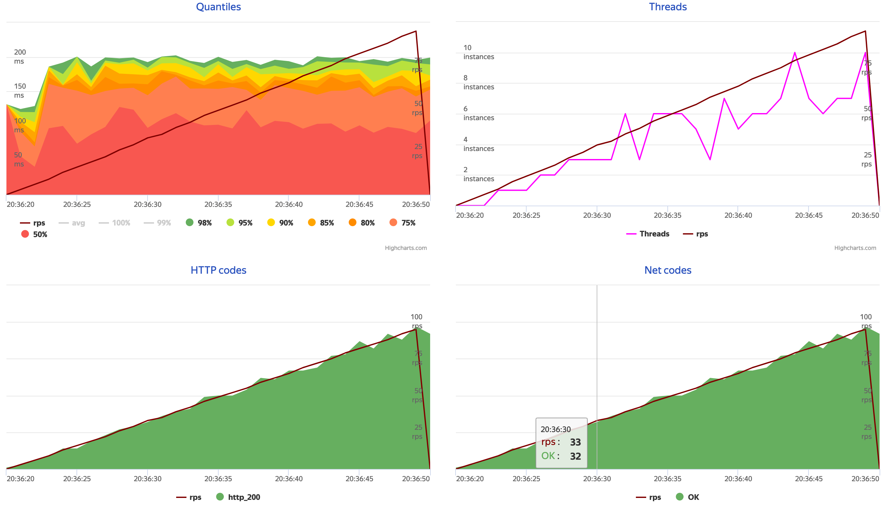

# Load testing

This is demo of a load testing setup based on
[Yandex Tank](https://yandextank.readthedocs.io/en/latest/) (plugin-based test runner)
with the following plugins:

- [Pandora](https://yandextank.readthedocs.io/en/latest/core_and_modules.html#pandora) (load generator)
- [Overload](https://overload.yandex.net) (testing result viewer)

The system under test is a Go program that shows a list of books with random latencies up to 200ms.

```sh
$ git clone https://github.com/marselester/load-testing.git
$ cd ./load-testing
$ go run ./cmd/server/main.go
$ curl localhost:8000/v1/books
{"books": [{"name": "The Adventures of Tom Sawyer"}]}
```

Install Yandex Tank

```sh
$ virtualenv venv
$ source ./venv/bin/activate
$ pip install https://api.github.com/repos/yandex/yandex-tank/tarball/master
```

Install Pandora

```sh
$ go get github.com/yandex/pandora
```

Yandex Tank configuration is defined in [load.yml](load.yml).
Test data [ammo.json](ammo.json) describes the HTTP requests a load generator will send to a Go program.
In this case Pandora will start from sending `GET /v1/books` 1 request per second and progress to
100 requests per second for duration of 30 seconds.

Start testing:

```sh
$ yandex-tank -c load.yml
```

The results will be available at https://overload.yandex.net
(you'll need to sign in to get an API token and store it in `overload-token.txt`).


